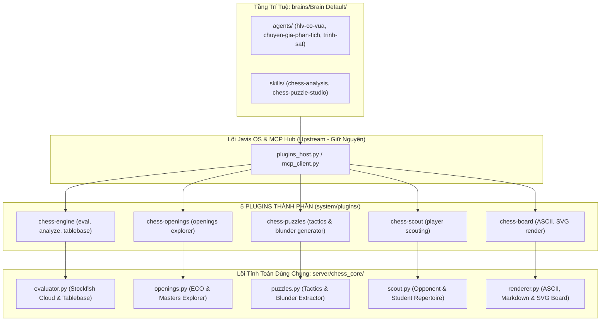

# Hướng Dẫn Kỹ Thuật: Javis Modular Chess Plugins (Bộ Năng Lực Cờ Vua Toàn Diện)

Tài liệu hướng dẫn sử dụng và cấu trúc kỹ thuật của hệ thống **5 Micro-Plugins Chuyên Môn Cờ Vua** được tích hợp trong Javis OS cho hệ sinh thái Cờ vua Dương Sinh.

---

## 1. Kiến Trúc Modular & Tính Độc Lập



> **Ưu điểm vượt trội của mô hình 5 Modular Plugins:**
> 1. **Bật/Tắt độc lập:** Người dùng có thể bật/tắt từng plugin trực tiếp trong trang **Năng lực > Plugins** trên Web Dashboard.
> 2. **Tiết kiệm Token Context:** Tránh bơm toàn bộ công cụ vào prompt nếu chỉ dùng tính năng giải đố hoặc trinh sát.
> 3. **Không xung đột Upstream:** Toàn bộ plugin và module tính toán nằm độc lập, cập nhật repo gốc thoải mái không lo merge conflict.

---

## 2. Danh Sách 5 Plugin & Các Công Cụ Native

### 1. Plugin `chess-engine`
- `chess_eval`: Đánh giá thế cờ FEN/PGN bằng Stockfish Cloud & Syzygy Tablebase.
- `chess_game_analyze`: Phân tích ván đấu PGN, tìm Blunder, Mistake, Inaccuracy, tính ACPL và điểm Accuracy %.
- `chess_tablebase`: Tra cứu cờ tàn 7 quân tuyệt đối (Syzygy Tablebase 100%).

### 2. Plugin `chess-openings`
- `chess_openings`: Tra cứu sách khai cuộc ECO & thống kê ván đấu của các Đại kiện tướng từ Lichess Masters Explorer.

### 3. Plugin `chess-puzzles`
- `chess_puzzles`: Lấy bài tập chiến thuật theo chủ đề/Elo, hoặc tự động trích xuất bài tập sửa lỗi từ ván đấu học viên.

### 4. Plugin `chess-scout`
- `chess_player_scout`: Lập hồ sơ trinh sát kỳ thủ qua Lichess / Chess.com: thống kê thói quen khai cuộc khi cầm Trắng & Đen.

### 5. Plugin `chess-board`
- `chess_render_board`: Sinh hình ảnh bàn cờ trực quan (ASCII / Markdown / SVG) có tọa độ rõ ràng.

---

## 3. Các Agent & Skill Đi Kèm Trong Brain

1. **Agent `hlv-co-vua`:** Huấn luyện viên trưởng giải đáp thế cờ, sửa bài tập và động viên học viên.
2. **Agent `chuyen-gia-phan-tich-van-dau`:** Chuyên gia phân tích chuyên sâu các ván đấu sau giải, rút ra bài học cốt lõi.
3. **Agent `trinh-sat-doi-thu`:** Trợ lý trinh sát khai cuộc và lập kế hoạch khắc chế đối thủ trước trận đấu.
4. **Skill `chess-analysis`:** Quy trình chuẩn phân tích ván đấu và thế cờ.
5. **Skill `chess-puzzle-studio`:** Quy trình thiết kế giáo án và sinh bài tập chiến thuật.

---

## 4. Kiểm Thử Tự Động

Chạy toàn bộ bài kiểm thử tự động của 5 Modular Chess Plugins:
```powershell
.\.venv\Scripts\python.exe tests/python/test_chess_modular_plugins.py
.\.venv\Scripts\python.exe tests/python/test_duongsinh_mcp.py
```
