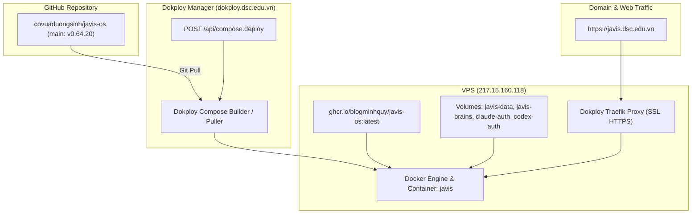

# Kế hoạch triển khai (Deploy) Javis OS v0.64.20 lên VPS qua Dokploy

> **For agentic workers:** REQUIRED SUB-SKILL: Use superpowers:subagent-driven-development to implement this plan task-by-task. Steps use checkbox (`- [ ]`) syntax for tracking.

**Goal:** Triển khai phiên bản Javis OS mới nhất (v0.64.20) đã đồng bộ trên GitHub `covuaduongsinh/javis-os` lên VPS Dokploy tại `217.15.160.118`, phục vụ tại domain `https://javis.dsc.edu.vn`.

**Architecture:** Sử dụng Dokploy REST API (x-api-key) để kích hoạt quá trình Redeploy Compose Project `javis` (`composeId: qXE2SOod0UndLHhBfdNNi`). Đồng thời sử dụng kết nối SSH (root) để giám sát tiến trình kéo image `ghcr.io/blogminhquy/javis-os:latest`, nạp git commit mới nhất, kiểm tra healthcheck container và định tuyến Traefik SSL.

**Architecture Diagram:**



**Tech Stack:** Dokploy v0.30.2, Docker Compose, Traefik, OpenSSH, curl / Python.

**Spec:** Dokploy application ID: `qXE2SOod0UndLHhBfdNNi`, Project: `javis`, Domain: `javis.dsc.edu.vn`.

---

## Global Constraints

- Không làm gián đoạn các container khác đang hoạt động trên VPS (Typstify, MarkItDown, Calibre, Hermes, ChessNote, Paperclip, v.v.).
- Bảo toàn toàn bộ dữ liệu người dùng trong các volume cố định (`javis-data`, `javis-brains`, `claude-auth`, `codex-auth`).
- Mọi thao tác deploy phải được xác thực qua endpoint `/health` và kiểm tra log container.

---

### Task 1: Kích hoạt Dokploy Deploy qua API

**Files:**
- Dokploy Endpoint: `https://dokploy.dsc.edu.vn/api/compose.deploy`
- Payload: `{"composeId": "qXE2SOod0UndLHhBfdNNi"}`

- [ ] **Step 1: Gửi request trigger deploy tới Dokploy API**
  ```bash
  curl -s -k -X POST -H "Content-Type: application/json" -H "x-api-key: javis_appKLyoaMXqJKVnDyyKrssYKMGIfdkkrxpGUijBtXHdKehQOAMzrHcIPoacQLoSJmrE" -d '{"composeId":"qXE2SOod0UndLHhBfdNNi"}' https://dokploy.dsc.edu.vn/api/compose.deploy
  ```
- [ ] **Step 2: Giám sát trạng thái deployment trong Dokploy**
  ```bash
  curl -s -k -H "x-api-key: javis_appKLyoaMXqJKVnDyyKrssYKMGIfdkkrxpGUijBtXHdKehQOAMzrHcIPoacQLoSJmrE" https://dokploy.dsc.edu.vn/api/compose.one?composeId=qXE2SOod0UndLHhBfdNNi
  ```

---

### Task 2: Kiểm tra trạng thái Container và Logs trên VPS

**Files:**
- Host: `217.15.160.118` (user: `root`, port `22`)

- [ ] **Step 1: Kiểm tra container `javis` đã khởi động với image mới và gắn nhãn Traefik chính xác**
  ```bash
  ssh -i C:\Users\duongsinh\.ssh\id_ed25519 -p 22 root@217.15.160.118 "docker ps -f name=javis"
  ```
- [ ] **Step 2: Kiểm tra logs khởi động của container `javis`**
  ```bash
  ssh -i C:\Users\duongsinh\.ssh\id_ed25519 -p 22 root@217.15.160.118 "docker logs javis --tail 50"
  ```

---

### Task 3: Xác thực truy cập Public Domain `https://javis.dsc.edu.vn`

**Files:**
- Domain: `https://javis.dsc.edu.vn`

- [ ] **Step 1: Kiểm tra endpoint `/health` trả về HTTP 200 OK**
  ```bash
  curl -s -I https://javis.dsc.edu.vn/health
  ```
- [ ] **Step 2: Kiểm tra trang chủ và phiên bản hoạt động**
  ```bash
  curl -s https://javis.dsc.edu.vn/static/version.json
  ```

---

## Verification Plan

### Automated Tests
1. **Kiểm tra Dokploy Deployment status:**
   API `https://dokploy.dsc.edu.vn/api/compose.one` trả về `composeStatus: "done"`.
2. **Kiểm tra Healthcheck:**
   `https://javis.dsc.edu.vn/health` trả về `{"status":"ok"}` hoặc HTTP 200.

### Manual Verification
1. Mở trình duyệt truy cập `https://javis.dsc.edu.vn`.
2. Đăng nhập và xác nhận các tính năng v0.64.20 (Coding Workspace, Hội thoại khách, Chế độ giọng nói mới) hoạt động bình thường.
