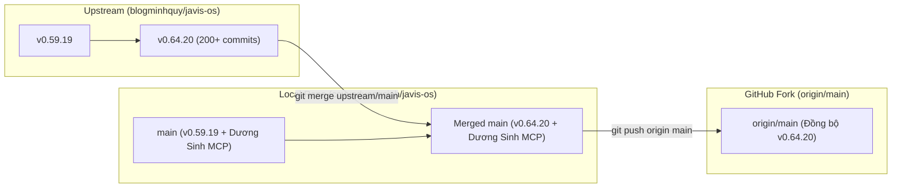

# Kế hoạch đồng bộ bản cập nhật từ upstream (v0.64.20) vào local và GitHub

> **For agentic workers:** REQUIRED SUB-SKILL: Use superpowers:subagent-driven-development to implement this plan task-by-task. Steps use checkbox (`- [ ]`) syntax for tracking.

**Goal:** Đồng bộ toàn bộ các cập nhật mới nhất từ repository gốc `upstream/main` (từ bản 0.59.19 lên 0.64.20) vào branch `main` ở máy local và đẩy lên remote GitHub (`origin/main`), đồng thời đảm bảo an toàn tuyệt đối cho các tính năng tùy biến riêng (Cờ vua Dương Sinh MCP, Dokploy configuration).

**Architecture:** Sử dụng chiến lược `git merge upstream/main` để tích hợp hơn 200+ thay đổi (workspace coding, hội thoại khách, voice fixes, v.v.) vào nhánh `main` nội bộ. Toàn bộ các module custom của nhánh nội bộ (`server/duongsinh_mcp.py`, `system/mcp-catalog.json`, `server/mcp_client.py`, `docker-compose.dokploy.yml`, `tests/python/test_duongsinh_mcp.py`) đã được kiểm tra tách biệt và tự động hòa nhập không xảy ra xung đột.

**Architecture Diagram:**



**Tech Stack:** Git, Python 3.8+ / venv, FastAPI, Node.js / Browser tests.

**Spec:** Kế hoạch thực hiện đồng bộ upstream và lưu trữ kế hoạch chuẩn hóa trong thư mục [docs/plans/](file:///D:/code/javis-os/docs/plans).

---

## Global Constraints

- Không làm mất hoặc xáo trộn bất kỳ file custom nào của fork (`server/duongsinh_mcp.py`, `tests/python/test_duongsinh_mcp.py`, `docker-compose.dokploy.yml`, `system/mcp-catalog.json`).
- Mọi kế hoạch từ nay được lưu vào thư mục `docs/plans/`.
- Kiểm tra toàn bộ test suite (Python tests với `.venv/Scripts/python.exe` và unit test Dương Sinh) trước khi đẩy lên GitHub.
- Đảm bảo commit merge có thông điệp rõ ràng theo quy ước phiên bản.

---

### Task 1: Thiết lập thư mục lưu trữ kế hoạch chuẩn hóa

**Files:**
- Create: [docs/plans/README.md](file:///D:/code/javis-os/docs/plans/README.md)
- Create: [docs/plans/2026-09-23-dong-bo-upstream-v0-64-20.md](file:///D:/code/javis-os/docs/plans/2026-09-23-dong-bo-upstream-v0-64-20.md)

- [ ] **Step 1: Khởi tạo quy ước lưu trữ kế hoạch trong `docs/plans/README.md`**
- [ ] **Step 2: Lưu bản kế hoạch đồng bộ chi tiết vào `docs/plans/2026-09-23-dong-bo-upstream-v0-64-20.md`**

---

### Task 2: Thực hiện Merge cập nhật từ `upstream/main` vào `main` local

**Files:**
- Modify: 221 files từ upstream (tính năng Coding workspace, Voice, Chatbot V2, ChatGPT Connector, ...)
- Preserve: [server/duongsinh_mcp.py](file:///D:/code/javis-os/server/duongsinh_mcp.py), [tests/python/test_duongsinh_mcp.py](file:///D:/code/javis-os/tests/python/test_duongsinh_mcp.py), [docker-compose.dokploy.yml](file:///D:/code/javis-os/docker-compose.dokploy.yml)

- [ ] **Step 1: Thực hiện lệnh merge `upstream/main` vào nhánh `main`**
  ```bash
  git merge upstream/main -m "Merge upstream updates (v0.64.20) from blogminhquy/javis-os"
  ```
- [ ] **Step 2: Kiểm tra trạng thái git working tree sau khi merge**
  ```bash
  git status
  ```

---

### Task 3: Chạy kiểm thử xác thực toàn diện (Regression Testing)

**Files:**
- Test: [tests/python/test_duongsinh_mcp.py](file:///D:/code/javis-os/tests/python/test_duongsinh_mcp.py)
- Test: [tests/python/test_mcp_lazy.py](file:///D:/code/javis-os/tests/python/test_mcp_lazy.py)

- [ ] **Step 1: Chạy test cầu nối Cờ vua Dương Sinh MCP**
  ```powershell
  .\.venv\Scripts\python.exe tests/python/test_duongsinh_mcp.py
  ```
  Expected: 70+ checks passed, "Tất cả test xanh."
- [ ] **Step 2: Chạy test các thành phần cốt lõi của server**
  ```powershell
  .\.venv\Scripts\python.exe -m pytest tests/python/test_mcp_lazy.py
  ```

---

### Task 4: Đồng bộ lên GitHub (`origin/main`) và tạo Walkthrough

**Files:**
- Push: `origin/main`

- [ ] **Step 1: Đẩy commit đã merge và file kế hoạch lên GitHub**
  ```bash
  git push origin main
  ```
- [ ] **Step 2: Xác nhận `origin/main` đã khớp hoàn toàn với `HEAD` local**
  ```bash
  git log -1 origin/main
  ```
- [ ] **Step 3: Tạo báo cáo tổng kết Walkthrough cho người dùng**

---

## Verification Plan

### Automated Tests
1. **Kiểm tra Cờ vua Dương Sinh MCP:**
   ```powershell
   .\.venv\Scripts\python.exe tests/python/test_duongsinh_mcp.py
   ```
2. **Kiểm tra MCP Lazy Loading:**
   ```powershell
   .\.venv\Scripts\python.exe -m pytest tests/python/test_mcp_lazy.py
   ```

### Manual Verification
1. Kiểm tra log `git log --oneline -n 10` để thấy commit hợp nhất upstream v0.64.20.
2. Kiểm tra link GitHub repository của người dùng (`https://github.com/covuaduongsinh/javis-os`) đã nhận các commit mới nhất.
