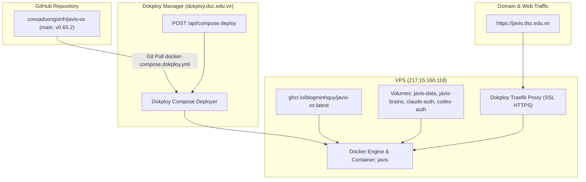

# Kế hoạch triển khai (Deploy) Javis OS v0.65.2 lên VPS Dokploy

**Goal:** Triển khai phiên bản Javis OS mới nhất (v0.65.2) từ GitHub `covuaduongsinh/javis-os` lên VPS Dokploy tại `217.15.160.118`, phục vụ ổn định tại domain `https://javis.dsc.edu.vn`.

---

## 1. Thông tin hạ tầng & Cấu hình triển khai

- **VPS IP:** `217.15.160.118`
- **SSH Access:** `root@217.15.160.118:22` (Sử dụng key `C:\Users\duongsinh\.ssh\id_ed25519`)
- **Dokploy Control Panel:** `https://dokploy.dsc.edu.vn`
- **Dokploy Compose ID:** `qXE2SOod0UndLHhBfdNNi`
- **Dokploy App Name:** `compose-back-up-solid-state-program-8n8fy4`
- **Domain:** `https://javis.dsc.edu.vn` (SSL Let's Encrypt qua Dokploy Traefik Proxy)
- **Container Service:** `javis` (Image: `ghcr.io/blogminhquy/javis-os:latest`)
- **Volumes cần bảo toàn:** `javis-data`, `javis-brains`, `claude-auth`, `codex-auth`

---

## 2. Sơ đồ Luồng Triển Khai (Deployment Flow)

---

## 3. Ràng buộc toàn cục (Global Constraints)

- **Bảo toàn dữ liệu:** Không xóa hay ghi đè các volumes dữ liệu quan trọng (`javis-data`, `javis-brains`, `claude-auth`, `codex-auth`).
- **An toàn các dịch vụ khác trên VPS:** Không làm ảnh hưởng tới các container khác đang chạy trên VPS (ERPNext, Typstify, Firecrawl, Hermes, Paperclip, ChessNote, v.v.).
- **Xác thực toàn diện:** Kiểm tra cả trạng thái deployment API của Dokploy, trạng thái docker container, log khởi động và endpoint public `https://javis.dsc.edu.vn/health`.

---

## 4. Các bước triển khai chi tiết

### Task 1: Kích hoạt Dokploy Deploy qua REST API
- Endpoint: `https://dokploy.dsc.edu.vn/api/compose.deploy`
- Payload: `{"composeId": "qXE2SOod0UndLHhBfdNNi"}`
- Header: `x-api-key: javis_appKLyoaMXqJKVnDyyKrssYKMGIfdkkrxpGUijBtXHdKehQOAMzrHcIPoacQLoSJmrE`

### Task 2: Theo dõi quá trình build/pull và khởi động container
- Kiểm tra Dokploy status: `https://dokploy.dsc.edu.vn/api/compose.one?composeId=qXE2SOod0UndLHhBfdNNi`
- Kiểm tra Docker container trên VPS: `docker ps -f name=javis`
- Kiểm tra log container: `docker logs javis --tail 50`

### Task 3: Xác thực truy cập Public Domain
- Endpoint Healthcheck: `https://javis.dsc.edu.vn/health` (HTTP 200 OK)
- Endpoint Version: Kiểm tra phiên bản hiển thị `0.65.2`
