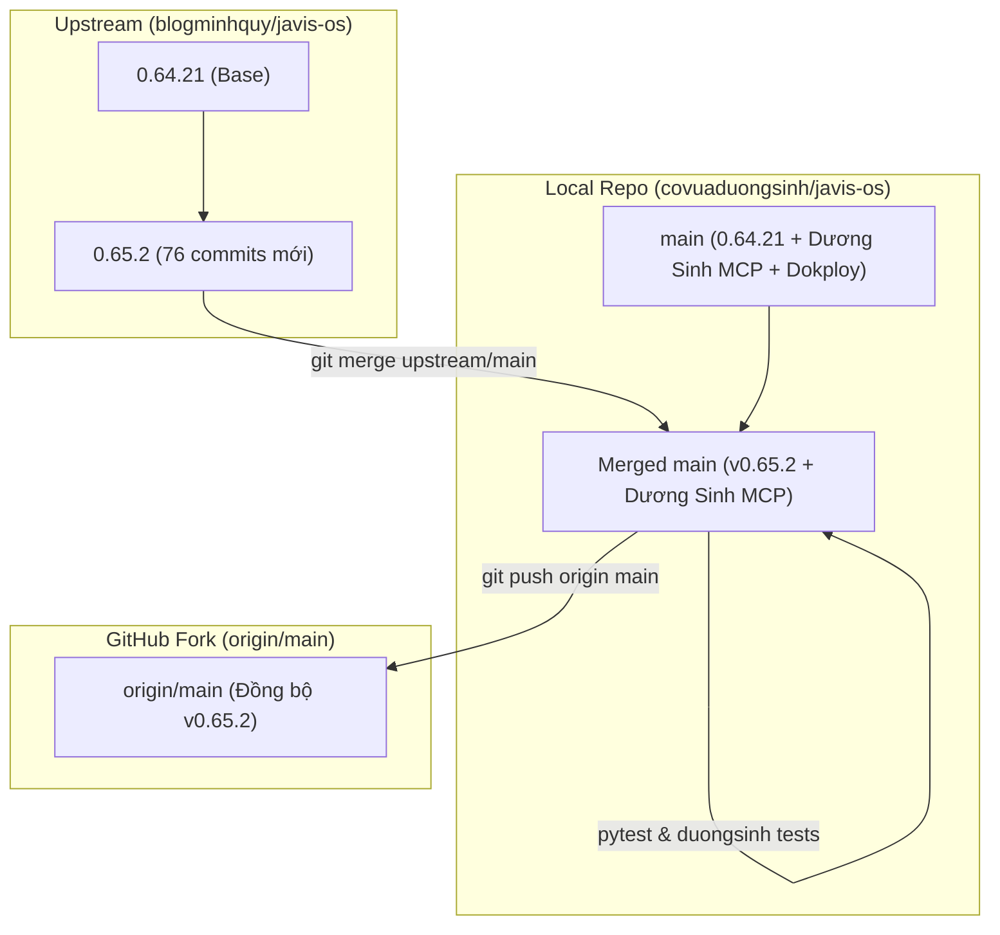

# Kế hoạch đồng bộ bản cập nhật từ upstream (v0.65.2) vào local và GitHub

> **Dành cho Agentic Workers:** Luôn tuân thủ quy ước lưu trữ kế hoạch tại [docs/plans/](file:///D:/code/javis-os/docs/plans) và đảm bảo kiểm thử toàn diện trước khi đẩy lên remote `origin`.

**Goal:** Đồng bộ 76 commits cập nhật mới nhất từ repository gốc `upstream/main` (từ bản 0.64.21 lên 0.65.2) vào nhánh `main` ở local và đẩy lên GitHub `origin/main`, đảm bảo tuyệt đối an toàn cho các tính năng và cấu hình tùy biến riêng (Cờ vua Dương Sinh MCP, Dokploy configuration, docs/plans).

---

## 1. Bối cảnh & Mục tiêu

- **Upstream:** `https://github.com/blogminhquy/javis-os.git` đang ở phiên bản `0.65.2` (commit `9e8dfba`).
- **Nội dung mới từ upstream (0.64.22 -> 0.65.2):**
  - **Bot & Zalo:** Bot tự trả lời Zalo cá nhân, bot trả lời nhóm Zalo, bộ phán xử hội thoại nhóm tự vận hành, cảnh báo quyền hạn nhóm.
  - **Lệnh hệ thống & Chat:** Bổ sung 12 lệnh slash `/` trên khung chat web & 4 lệnh cho Telegram. Khung xem mã sửa trực tiếp.
  - **Codex & AI:** Codex tự kết nối lại qua HTTPS khi WebSocket lỗi, Claude Code tự cập nhật model mới, hỗ trợ OpenAI Compatible provider, Groq Whisper config & STT improvements.
  - **UI/UX & Mobile:** Tinh chỉnh hiển thị trên mobile, bảng chọn model, Be Vietnam Pro font, tối ưu hiệu ứng avatar linh vật và khung công cụ nền.
- **Local / Fork:** Đang ở bản 0.64.21 (commit `01182e7`). Đã tích hợp cầu nối Cờ vua Dương Sinh MCP, cấu hình Dokploy `docker-compose.dokploy.yml`, và thư mục quản lý kế hoạch `docs/plans/`.

---

## 2. Sơ đồ Kiến trúc & Luồng Đồng bộ



---

## 3. Ràng buộc toàn cục (Global Constraints)

- **Bảo toàn các file tùy biến của fork:**
  - `server/duongsinh_mcp.py`
  - `tests/python/test_duongsinh_mcp.py`
  - `docker-compose.dokploy.yml`
  - `system/mcp-catalog.json` (giữ nguyên khai báo connector Dương Sinh)
  - `docs/plans/` (toàn bộ các tài liệu kế hoạch)
- **Quy tắc kế hoạch:** Mọi kế hoạch từ nay luôn được lưu trữ tại `docs/plans/`.
- **Kiểm thử bắt buộc:** Chạy test suite `test_duongsinh_mcp.py` và các bài kiểm thử hồi quy trước khi `git push`.

---

## 4. Kế hoạch triển khai chi tiết (Bite-sized Tasks)

### Task 1: Lưu trữ tài liệu kế hoạch vào `docs/plans/`
- **Files:**
  - [NEW] [docs/plans/2026-09-30-dong-bo-upstream-v0-65-2.md](file:///D:/code/javis-os/docs/plans/2026-09-30-dong-bo-upstream-v0-65-2.md)
- [ ] **Step 1:** Khởi tạo file kế hoạch chi tiết cho đợt nâng cấp 0.65.2.

---

### Task 2: Thực hiện Merge `upstream/main` vào nhánh `main` local
- **Files:**
  - Gộp các thay đổi từ 76 commits upstream.
  - Tự động giữ nguyên các file mở rộng nội bộ.
- [ ] **Step 1:** Chạy lệnh merge upstream:
  ```bash
  git merge upstream/main -m "Merge upstream updates (v0.65.2) from blogminhquy/javis-os"
  ```
- [ ] **Step 2:** Kiểm tra `git status` và xác nhận không có xung đột (merge clean).

---

### Task 3: Kiểm thử hồi quy và xác thực toàn vẹn (Verification)
- **Files:**
  - [tests/python/test_duongsinh_mcp.py](file:///D:/code/javis-os/tests/python/test_duongsinh_mcp.py)
  - [tests/python/test_zalo_bot.py](file:///D:/code/javis-os/tests/python/test_zalo_bot.py)
  - [tests/python/test_mcp_lazy.py](file:///D:/code/javis-os/tests/python/test_mcp_lazy.py)
- [ ] **Step 1:** Chạy test kiểm tra cầu nối Cờ vua Dương Sinh MCP:
  ```powershell
  .\.venv\Scripts\python.exe tests/python/test_duongsinh_mcp.py
  ```
- [ ] **Step 2:** Chạy test các tính năng mới/cập nhật từ upstream:
  ```powershell
  .\.venv\Scripts\python.exe -m pytest tests/python/test_zalo_bot.py tests/python/test_mcp_lazy.py
  ```

---

### Task 4: Đồng bộ lên GitHub (`origin/main`)
- **Files:**
  - Push toàn bộ commits merge và file kế hoạch lên `origin/main`.
- [ ] **Step 1:** Đẩy thay đổi lên GitHub:
  ```bash
  git push origin main
  ```
- [ ] **Step 2:** Xác nhận trạng thái branch `main` đã đồng bộ với cả `upstream/main` và `origin/main`.
