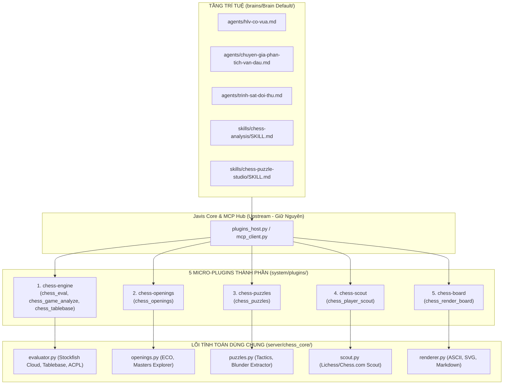

# Kế hoạch & Kiến Trúc Bộ Plugin Chuyên Môn Cờ Vua Độc Lập (Javis Modular Chess Plugins)

> **Mục tiêu:** Mở rộng Javis OS thành **Trợ lý AI Đại Kiện Tướng & Huấn luyện viên Trưởng** cho hệ sinh thái Cờ vua Dương Sinh thông qua **Kiến trúc Modular Micro-Plugins (5 Plugin thành phần độc lập)** kết hợp **Tầng Trí tuệ Brain Layer**, đảm bảo:
> 1. **Quản lý linh hoạt:** Bật/tắt từng plugin độc lập trên Web Dashboard của Javis.
> 2. **Tối ưu Token & Context Window:** Không làm phình prompt khi chỉ dùng một tính năng cụ thể.
> 3. **Cách ly tuyệt đối:** Không bao giờ gây xung đột khi git pull/merge từ repository gốc `blogminhquy/javis-os`.

---

## 1. Tư Vấn Chuyên Môn: Vì Sao Nên Chia Thành Các Plugin Thành Phần?

So sánh giữa **1 Plugin đơn khối (Monolithic)** vs **5 Micro-Plugins thành phần (Modular)**:

| Tiêu chí | 1 Plugin Đơn Khối (`chess-studio`) | 5 Plugin Thành Phần (`chess-*`) | Đánh giá |
|---|---|---|---|
| **Bật/Tắt trên Dashboard** | Bật là bật hết 7 tool, tắt là tắt hết. | Bật/tắt độc lập từng tính năng theo nhu cầu từng người dùng / HLV. | ⭐ **Modular vượt trội** |
| **Tiêu hao Token Prompt** | Luôn bơm cả 7 tool schema vào ngữ cảnh mỗi lượt chat (~1,500 tokens). | Chỉ bơm các tool của plugin đang được bật (tiết kiệm 60-80% token). | ⭐ **Modular vượt trội** |
| **Độ chính xác gọi tool (Tool Calling)** | Model dễ nhầm lẫn giữa quá nhiều tool cờ trong một phiên chat. | Model tập trung đúng bộ tool chuyên trách của từng Agent. | ⭐ **Modular vượt trội** |
| **Bảo trì & Mở rộng** | Sửa 1 tính năng phải test lại toàn bộ plugin lớn. | Từng plugin có file manifest & handler riêng biệt, dùng chung lõi `chess_core`. | ⭐ **Modular vượt trội** |

👉 **Kết luận:** Việc chia nhỏ thành **5 Plugin thành phần** là phương án kiến trúc chuẩn mực và tối ưu nhất cho Javis OS.

---

## 2. Sơ Đồ Kiến Trúc 5 Micro-Plugins & Tầng Dữ Liệu Dùng Chung



---

## 3. Chi Tiết 5 Plugin Thành Phần & Danh Mục Tools

### 1. 🧩 Plugin `chess-engine` (Đánh Giá Thế Cờ & Phân Tích Ván Đấu)
- **Thư mục:** `system/plugins/chess-engine/`
- **Mục đích:** Cung cấp sức mạnh tính toán cờ vua cho AI qua Stockfish Cloud và Syzygy Tablebase.
- **Công cụ cung cấp:**
  - `chess_eval(fen, pgn, multi_pv)`: Đánh giá điểm số centipawns / mate, gợi ý các biến tối ưu.
  - `chess_game_analyze(pgn, max_moves)`: Phân tích toàn bộ ván đấu, phát hiện blunder/mistake, tính accuracy % và ACPL.
  - `chess_tablebase(fen)`: Tra cứu kết quả cờ tàn 7 quân tuyệt đối từ Syzygy Endgame Tablebase.

### 2. 📖 Plugin `chess-openings` (Tra Cứu Khai Cuộc ECO & Grandmaster DB)
- **Thư mục:** `system/plugins/chess-openings/`
- **Mục đích:** Tra cứu bách khoa toàn thư khai cuộc ECO và dữ liệu ván đấu của các Đại kiện tướng.
- **Công cụ cung cấp:**
  - `chess_openings(fen, moves)`: Nhận diện tên khai cuộc, mã ECO (A00-E99), thống kê tỷ lệ Thắng/Hòa/Thua của Grandmasters.

### 3. 🎯 Plugin `chess-puzzles` (Ngân Hàng Bài Tập & Trích Xuất Sai Lầm)
- **Thư mục:** `system/plugins/chess-puzzles/`
- **Mục đích:** Sinh bài tập chiến thuật theo chủ đề/Elo và trích xuất bài tập sửa lỗi từ chính ván thua của học viên.
- **Công cụ cung cấp:**
  - `chess_puzzles(theme, min_rating, max_rating, count, pgn, player)`: Tìm bài tập chiến thuật (*pin, fork, skewer, mate...*) hoặc trích xuất blunder từ PGN.

### 4. 🕵️ Plugin `chess-scout` (Trinh Sát Đối Thủ & Kỳ Thủ Trực Tuyến)
- **Thư mục:** `system/plugins/chess-scout/`
- **Mục đích:** Lập hồ sơ trinh sát đối thủ trước trận đấu qua Lichess / Chess.com.
- **Công cụ cung cấp:**
  - `chess_player_scout(username, platform, nb_games)`: Thống kê thói quen khai cuộc khi cầm Trắng/Đen, tỷ lệ thắng thua và các điểm yếu chiến thuật.

### 5. 🎨 Plugin `chess-board` (Biểu Diễn Bàn Cờ Trực Quan)
- **Thư mục:** `system/plugins/chess-board/`
- **Mục đích:** Vẽ hình ảnh bàn cờ trực quan cho học viên và phụ huynh.
- **Công cụ cung cấp:**
  - `chess_render_board(fen, perspective, format, last_move)`: Sinh bàn cờ định dạng ASCII, Markdown hoặc SVG sắc nét.

---

## 4. Phân Bổ Plugin Tương Ứng Cho Từng Agent Chuyên Môn

Mỗi Agent trong Brain sẽ chỉ tập trung kích hoạt và sử dụng những plugin phù hợp nhất với vai trò của mình:

```
┌───────────────────────────────────────┬──────────────────────────────────────────────┐
│ Agent                                 │ Các Plugin & Tool Trọng Tâm                 │
├───────────────────────────────────────┼──────────────────────────────────────────────┤
│ 👨‍🏫 Huấn luyện viên trưởng             │ chess-puzzles, chess-engine, chess-board     │
│ 🧐 Chuyên gia phân tích ván đấu       │ chess-engine, chess-openings, chess-board    │
│ 🎯 Trợ lý trinh sát đối thủ           │ chess-scout, chess-openings, chess-engine    │
└───────────────────────────────────────┴──────────────────────────────────────────────┘
```

---

## 5. Kế Hoạch Xác Minh & Kiểm Thử Tự Động (Verification Plan)

- **Test Suite Phân Tách:** `tests/python/test_chess_modular_plugins.py`
  - Đảm bảo 5 plugin đều đăng ký thành công vào `PluginContext`.
  - Kiểm tra độc lập từng plugin khi chạy riêng lẻ.
  - Đảm bảo kiểm thử hồi quy `test_duongsinh_mcp.py` pass 100%.
