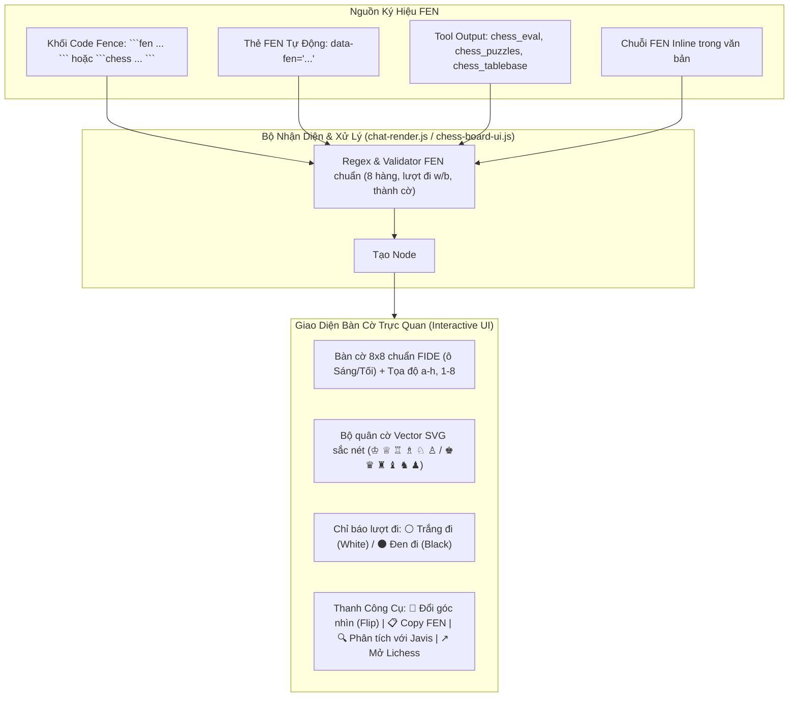
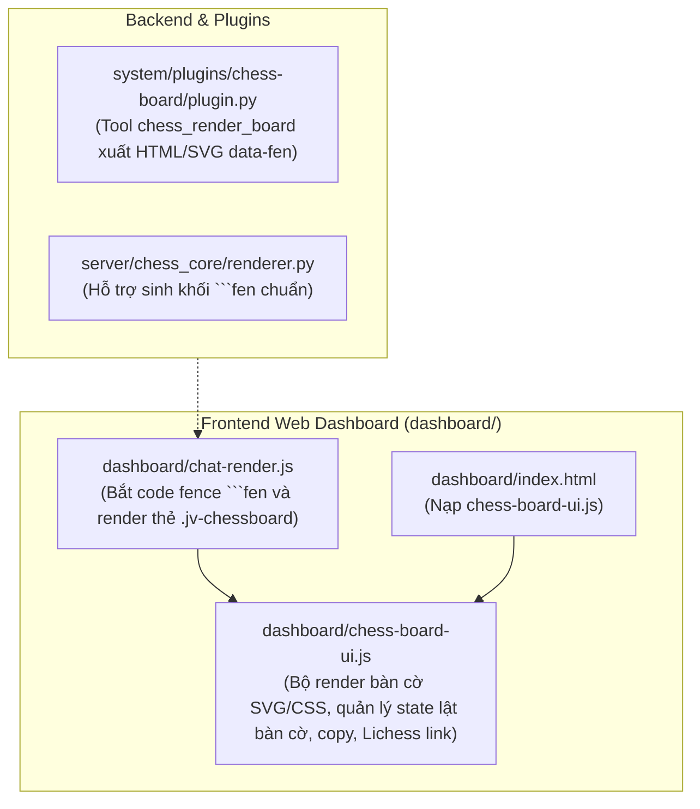

# Kế Hoạch Triển Khai: Tính Năng Hiển Thị Bàn Cờ Trực Quan Tại Vị Trí Ký Hiệu Thế Cờ FEN

> **Mục tiêu:** Bổ sung tính năng **nhận diện và hiển thị bàn cờ cờ vua trực quan (Interactive Visual Chessboard)** trực tiếp tại các vị trí xuất hiện ký hiệu thế cờ FEN trong tin nhắn chat, ghi chú, hoặc tài liệu Markdown của Javis OS, mang lại trải nghiệm chuyên môn cờ vua trực quan, sinh động cho Huấn luyện viên, Học viên và Phụ huynh.

---

## 1. Bối Cảnh & Nhu Cầu

- **Hiện trạng:** 
  - Ký hiệu thế cờ FEN (*Forsyth–Edwards Notation*, ví dụ: `r1bqkb1r/pppp1ppp/2n5/4p3/2B1n3/5N2/PPPP1PPP/RNBQK2R w KQkq - 0 5`) là tiêu chuẩn lưu trữ thế cờ trên máy tính, nhưng đối với mắt người (HLV, học viên, phụ huynh), đọc một chuỗi FEN rất khó hình dung thế trận.
  - Hiện tại, Javis đã có công cụ tính toán và vẽ bàn cờ ASCII/SVG, nhưng chưa tự động biến đổi các chuỗi FEN trong khung chat thành **bàn cờ tương tác trực quan ngay tại chỗ**.
- **Giải pháp:**
  - Xây dựng bộ dựng bàn cờ trực quan nhẹ, thuần SVG/CSS/JS (không phụ thuộc CDN nặng), tự động bắt các vị trí có ký hiệu FEN (khối code ```` ```fen ````, ```` ```chess ````, thẻ cờ `data-fen`, hoặc khối FEN trong tin nhắn) và hiển thị thành bàn cờ chuẩn thi đấu sắc nét.

---

## 2. Các Kịch Bản Hiển Thị & Định Dạng Nhận Diện Thế Cờ FEN



---

## 3. Chi Tiết Tính Năng Của Component Bàn Cờ Trực Quan

1. **Hiển thị Bàn cờ 8x8 Chuẩn Sắc Nét:**
   - Vẽ bàn cờ 8x8 với 64 ô màu gỗ / slate hiện đại, tương thích hoàn hảo cả Giao diện Sáng (Light Mode) và Giao diện Tối (Dark Mode) của Javis OS.
   - Hiển thị tọa độ hàng (1 đến 8) và cột (a đến h) ở mép bàn cờ.
   - Sử dụng bộ quân cờ vector SVG đẹp mắt, co giãn mượt mà trên cả máy tính và điện thoại.
2. **Nhận Diện & Thao Tác Thông Minh:**
   - **Chỉ báo lượt đi (Turn Indicator):** Nhận diện `w` (Trắng đi) hoặc `b` (Đen đi) trong FEN để hiển thị huy hiệu: `⚪ Lượt Trắng đi` hoặc `⚫ Lượt Đen đi`.
   - **🔄 Nút Đổi góc nhìn (Flip Board):** Cho phép đảo ngược bàn cờ để xem từ góc nhìn quân Trắng hoặc quân Đen.
   - **📋 Nút Copy FEN:** Sao chép nhanh mã FEN chuẩn vào bộ nhớ đệm chỉ với 1 click kèm thông báo toast.
   - **🔍 Nút Phân tích với Javis (Analyze):** Tự động điền câu lệnh phân tích thế cờ vào khung chat gửi cho Agent Huấn luyện viên Javis.
   - **↗ Nút Mở trên Lichess:** Mở thế cờ trên trang phân tích Lichess Analysis trong tab mới để đi thử các nước biến.

---

## 4. Kiến Trúc Triển Khai & Đảm Bảo An Toàn Upstream



### Nguyên tắc thiết kế:
- **Tách riêng module `dashboard/chess-board-ui.js`:** Toàn bộ logic vẽ bàn cờ, icon quân cờ SVG, sự kiện click lật bàn cờ, copy FEN được đóng gói gọn trong file này.
- **Tích hợp liền mạch vào `chat-render.js`:** Chỉ bổ sung 1 dòng xử lý fence `fen` / `chess` trong `renderFence()` để chuyển đổi sang component bàn cờ.
- **Không xung đột khi git merge:** Các thành phần được module hóa, độc lập hoàn toàn với các logic nghiệp vụ khác của Javis OS.

---

## 5. Kế Hoạch Triển Khai Chi Tiết (Bite-sized Tasks)

### 🔹 Giai đoạn 1: Xây dựng Module Bàn Cờ Frontend (`dashboard/chess-board-ui.js`)
- [ ] Tạo file `dashboard/chess-board-ui.js`:
  - Khai báo bộ mã SVG cho 12 quân cờ (K, Q, R, B, N, P, k, q, r, b, n, p).
  - Hàm `parseFen(fen)`: Giải mã chuỗi FEN thành ma trận 8x8 quân cờ, lượt đi, quyền nhập thành, ô bắt tốt qua đường.
  - Hàm `renderChessboard(container, fen, options)`: Sinh cây DOM bàn cờ 8x8 kèm thanh công cụ điều khiển.
  - Xử lý sự kiện click: Đổi góc nhìn (Flip), Copy FEN, Phân tích với Javis, Mở Lichess.
  - Hàm quét và render tự động các thẻ `.jv-chessboard` sau khi tin nhắn chat xuất hiện.

### 🔹 Giai đoạn 2: Tích Hợp Vào Bộ Render Chat (`dashboard/chat-render.js` & `index.html`)
- [ ] Bổ sung xử lý code block ```` ```fen ````, ```` ```chess ````, ```` ```chessboard ```` trong hàm `renderFence` của `dashboard/chat-render.js`.
- [ ] Thêm thẻ `<script src="/static/chess-board-ui.js?v=1"></script>` vào `dashboard/index.html`.
- [ ] Tích hợp CSS cho bàn cờ vào `dashboard/chess-board-ui.js` hoặc stylesheet chung (đảm bảo hiển thị hoàn hảo trên mobile & desktop).

### 🔹 Giai đoạn 3: Nâng Cấp Backend & Plugin Chess Tool
- [ ] Cập nhật `system/plugins/chess-board/plugin.py` và `server/chess_core/renderer.py` để tool `chess_render_board` và `chess_eval` tự động xuất khối ```` ```fen ```` giúp giao diện web tự động biến thành bàn cờ động.
- [ ] Cập nhật các Agent `hlv-co-vua.md` và Skill `chess-analysis/SKILL.md` để AI luôn sử dụng khối ```` ```fen ```` khi phân tích thế trận.

### 🔹 Giai đoạn 4: Kiểm Thử Toàn Diện & Triển Khai Lên VPS
- [ ] Viết test tự động kiểm thử phân giải FEN trong `tests/python/test_chess_modular_plugins.py`.
- [ ] Kiểm thử thủ công trên trình duyệt web: hiển thị bàn cờ, lật mặt bàn cờ, copy FEN, mở Lichess.
- [ ] Git commit, push và đồng bộ lên VPS `javis.dsc.edu.vn`.

---

## 6. Kế Hoạch Xác Minh & Kiểm Thử (Verification Plan)

### Automated Tests
- Chạy test suite `test_chess_modular_plugins.py`:
  ```powershell
  .\.venv\Scripts\python.exe tests/python/test_chess_modular_plugins.py
  ```
- Kiểm tra tính hợp lệ của chuỗi FEN sinh ra từ các tool backend.

### Manual Verification
1. Mở giao diện Web Dashboard `https://javis.dsc.edu.vn` (hoặc `http://localhost:7777`).
2. Gửi tin nhắn chứa khối FEN:
   ````markdown
   ```fen
   r1bqkb1r/pppp1ppp/2n5/4p3/2B1n3/5N2/PPPP1PPP/RNBQK2R w KQkq - 0 5
   ```
   ````
3. Kiểm tra xem tin nhắn có hiển thị bàn cờ đẹp mắt với đầy đủ quân cờ hay không.
4. Bấm nút **🔄 Đổi góc nhìn**: Kiểm tra bàn cờ xoay từ góc nhìn Trắng sang góc nhìn Đen.
5. Bấm nút **📋 Copy FEN**: Kiểm tra clipboard nhận đúng chuỗi FEN.
6. Bấm nút **↗ Mở Lichess**: Kiểm tra tab mới mở đúng thế cờ trên Lichess.
